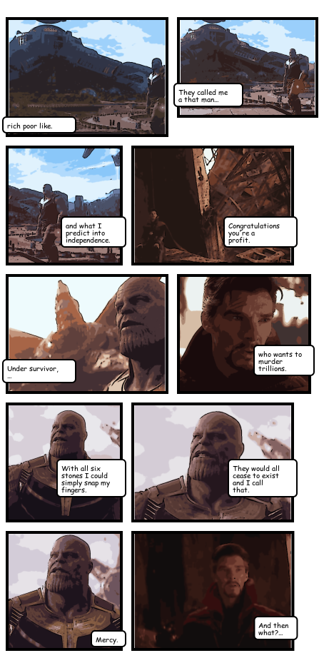

# YACK Automated Comic Kreator
**Hack Cambridge 2022**

Deepgram api is used for speech-to-text, get your key at https://deepgram.com and put it into `./.secrets` as
```env
DEEPGRAM_API_KEY=xxxxxxxxxxxxxxxxxxxxxxxxxxxxxxxxxxxxxxxx
```

To start developing using Docker, simply use
```shell
make run
```

Alternatively, create a virtual environment, and use
```shell
make install
```

## Sample comic


"They called me a Mad Man", source: https://youtu.be/fzGBRDpf5GU?t=102
